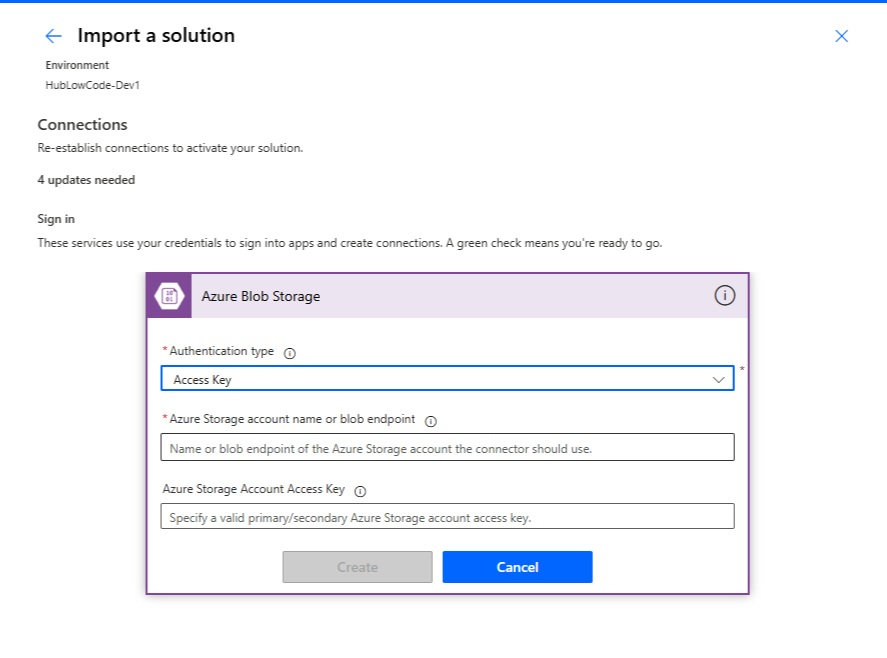

# MeetingTranscriptSummarizer

This repository contains the Power Platform Solution for the Meeting Transcript Summarizer Flow.

---

## 🔧 Prerequisites

Before importing the solution, ensure you have the following Azure resources created within your Azure Subscription:

### Required Azure Services

1. Azure Blob Storage Account  
2. Azure Speech Service Resource  

Azure Speech must be created in a region that supports **Fast Transcription API**.

Supported regions list:
https://learn.microsoft.com/en-us/azure/ai-services/speech-service/regions

⚠️ The Speech API endpoint region must match the region of your Azure Speech resource.

---

### Fast Transcription API Limits

When using the Fast Transcription REST API:

- Audio duration must be **less than 2 hours**
- File size must be **less than 250 MB**

Supported formats include:

WAV, MP3, OPUS/OGG, FLAC, WMA, AAC, ALAW in WAV container, MULAW in WAV container, AMR, WebM, SPEEX

---

## 🔗 Azure Blob Storage Connection Setup

During **Solution Import**, you will be prompted to create a new Azure Blob Storage connection as shown below:

Please fill in the values according to your Azure Storage Account:

| Field | Required Value | Where to find it |
|-------|---------------|------------------|
| Authentication Type | Access Key | Select from dropdown |
| Azure Storage account name or blob endpoint | Storage Account Name (NOT container name) | Azure Portal → Storage Account → Overview |
| Azure Storage Account Access Key | Primary or Secondary Key | Azure Portal → Storage Account → Access Keys |

---

### ✅ Example Mapping

If your Azure Blob Storage endpoint is:

https://meetingblobstorage.blob.core.windows.net

Then enter the following value in the field:

**Azure Storage account name or blob endpoint**

meetingblobstorage ✅

⚠️ **Do NOT enter**:
meetingblobstorage.blob.core.windows.net ❌
https://meetingblobstorage.blob.core.windows.net ❌
audiocontainer ❌

Only the **Storage Account Name** is required.

### 📌 Note

The container name (for example `audiocontainer`) is configured separately via the following **Environment Variable**:

ContainerFolderNameInBlob

---

## 🗄 Microsoft Dataverse Connection Setup

During Solution import, you will also be prompted to assign Microsoft Dataverse connection for AI Builder prompt execution.

Please select:

- Authentication Type: OAuth  
- Use the current environment connection  

Ensure that the Dataverse connection is created in your target Power Platform environment.

---

## 🎙 Azure Speech Fast Transcription API Endpoint

Please configure the following Environment Variable during import:

| Name | Value |
|------|-------|
| HTTP-FastTranscriptionAPI-EndPoint | https://<your-region>.api.cognitive.microsoft.com/speechtotext/transcriptions:transcribe?api-version=2025-10-15 |

Example:

https://eastus2.api.cognitive.microsoft.com/speechtotext/transcriptions:transcribe?api-version=2025-10-15

⚠️ The region must match the region of your Azure Speech resource.

---

## 📌 Environment Variables

Configure the following values during Solution import:

| Name | Description | Example |
|------|-------------|---------|
| SPOSiteURL-UploadFile | SharePoint Site URL | https://<your-tenant>.sharepoint.com/sites/<site> |
| SPOLibraryName-UploadFile | SharePoint Document Library Name | MeetingVoice |
| SpeechServiceAPIKEY | Azure Speech Service API Key | Set during import |
| HTTP-FastTranscriptionAPI-EndPoint | Azure Speech API Endpoint | See above |
| ContainerFolderNameInBlob | Azure Blob Container Name | audiocontainer |

---

## 🔗 Connection References

During Solution import, assign the following Connection References:

| Connection Reference | Required Connector |
|----------------------|--------------------|
| MeetingSummarizer-BlobStorageAccount | Azure Blob Storage |
| MeetingSummarizer-Dataverse For Prompt | Microsoft Dataverse |

Ensure these connections are mapped to environment‑specific resources.

---

## 🚀 Solution Import Steps

1. Import the unmanaged solution into your environment.
2. Create Azure Blob Storage connection.
3. Assign required Connection References.
4. Set Environment Variable values.
5. Turn on the Flow after import.

---

## 🔐 Security Best Practice

Do NOT store sensitive values such as:

- API Keys
- Storage Account Keys
- Endpoints

directly inside the Flow or repository.

Always use Environment Variables for environment‑specific configuration.

---

